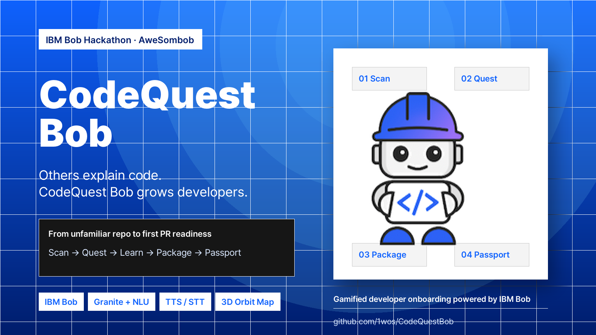
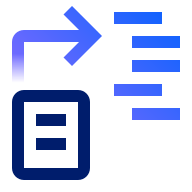
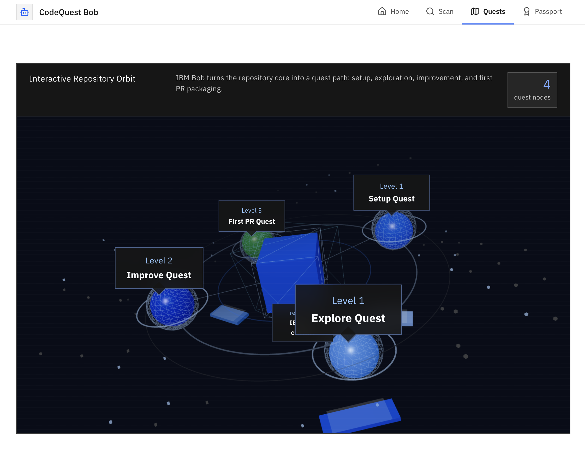
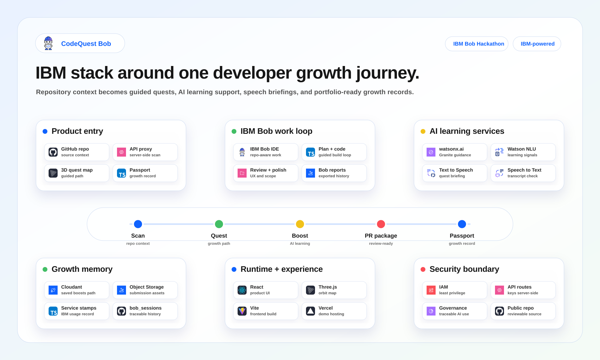

<p align="center">
  
</p>

<h1 align="center">CodeQuest Bob</h1>

<p align="center">
  <strong>Others explain code. CodeQuest Bob grows developers.</strong>
</p>

<p align="center">
  A gamified developer onboarding platform built with IBM Bob and IBM Cloud services.
</p>

<p align="center">
  <a href="https://codequest-bob.vercel.app"><strong>Live Demo</strong></a>
  ·
  <a href="docs/submission-assets/rendered/codequest-bob-pitch-deck.pdf"><strong>Pitch Deck</strong></a>
  ·
  <a href="docs/submission-assets/demo-video/codequest-bob-demo-voiceover.mp4"><strong>Demo Video</strong></a>
  ·
  <a href="bob_sessions/session-01-bob-task-history.md"><strong>IBM Bob Report</strong></a>
</p>

<p align="center">
  
  
  
  
  
</p>

<table align="center">
  <tr>
    <td align="center" width="120">
      <br />
      <sub>Repository</sub>
    </td>
    <td align="center" width="120">
      <br />
      <sub>watsonx.ai</sub>
    </td>
    <td align="center" width="120">
      <br />
      <sub>Cloudant</sub>
    </td>
    <td align="center" width="120">
      <br />
      <sub>Object Storage</sub>
    </td>
    <td align="center" width="120">
      <br />
      <sub>Governance</sub>
    </td>
    <td align="center" width="120">
      <br />
      <sub>API Proxy</sub>
    </td>
  </tr>
</table>

<p align="center">
  <sub>IBM Cloud architecture icons are used for service storytelling. The visual direction follows IBM Design Language app icon conventions.</sub>
</p>

<table align="center">
  <tr>
    <td align="center" width="170">
      <br />
      <sub>Watson NLU</sub>
    </td>
    <td align="center" width="170">
      <br />
      <sub>Text to Speech</sub>
    </td>
    <td align="center" width="170">
      <br />
      <sub>Speech to Text</sub>
    </td>
  </tr>
</table>

<p align="center">
  <sub>Watson service icons are sourced from the IBM Design Language App Icons Library.</sub>
</p>

## Overview

CodeQuest Bob turns an unfamiliar GitHub repository into a guided growth journey: scan the repo, understand the structure, complete contribution quests, collect service stamps, and prepare a first pull request package.

The project was built as a solo hackathon MVP for the IBM Bob Hackathon. IBM Bob acted as the development partner, while IBM Cloud services powered live repository learning experiences.

## Why It Matters

New contributors often lose momentum before their first meaningful pull request. Repository structure, setup steps, contribution norms, and missing documentation create a cognitive wall. Existing AI tools can explain code, but they rarely turn that understanding into a measurable growth path for the developer.

CodeQuest Bob reframes onboarding as a product experience:

| Contributor friction | CodeQuest Bob response |
| --- | --- |
| "Where do I start?" | Repository intake and live GitHub scan |
| "What should I learn first?" | Skill Boost Radar with IBM NLU and Granite reasoning |
| "What can I safely change?" | Step-by-step growth quests |
| "How do I prepare a PR?" | First PR Package with commands, notes, and checklist |
| "How do I show progress?" | Developer Growth Passport and Service Stamps |

## Product Flow

```text
Repository Intake
  -> Live GitHub Scan
  -> Growth Quest Map
  -> Quest Detail + Skill Boost Radar
  -> First PR Package
  -> Developer Growth Passport
```

The core product idea is simple: the developer should not only understand the repository. They should leave with confidence, evidence, and a next action.

## Product Preview

<p align="center">
  
</p>

<p align="center">
  <sub>The 3D Repository Orbit Map turns setup, exploration, improvement, and first PR packaging into a spatial quest path.</sub>
</p>

## Highlights

| Feature | What it does |
| --- | --- |
| Live Repository Intake | Reads public GitHub repository metadata through a server-side API route |
| Growth Quest Map | Guides the user through setup, exploration, improvement, and first PR readiness |
| 3D Repository Orbit Map | Uses React Three Fiber and Three.js to make repository structure memorable |
| Skill Boost Radar | Converts GitHub and Hugging Face signals into quest-specific learning recommendations |
| IBM Speech Briefing Loop | Generates audio quest briefings with IBM Text to Speech and verifies them with Speech to Text |
| First PR Package | Produces a contribution-ready package with target files, commands, PR copy, and reviewer notes |
| Developer Growth Passport | Tracks XP, saved boosts, service stamps, activity, and AI analysis history |

## IBM Bob Usage

IBM Bob was used as the primary AI development partner throughout the project.

| Bob contribution | Evidence |
| --- | --- |
| Repository analysis and MVP planning | [Exported Bob task history](bob_sessions/session-01-bob-task-history.md) |
| React + TypeScript architecture decisions | App shell, domain models, modular screens |
| Quest system and growth passport design | Quest data model, Service Stamps, Passport screen |
| IBM ecosystem integration planning | Vercel API proxy and IBM service routes |
| UI/UX review and copy refinement | Carbon-inspired polish, quest card refinement |
| Submission readiness | Pitch deck, demo video, README, deployed demo |

The public repository includes the exported IBM Bob report required for hackathon review:

```text
bob_sessions/
  README.md
  session-01-bob-task-history.md
```

## IBM Ecosystem Integration

| IBM technology | How it is used |
| --- | --- |
| IBM Bob IDE | Repository-aware planning, implementation support, review, exported task history |
| watsonx.ai / IBM Granite | Skill Boost reasoning and AI-generated recommendation explanations |
| Watson Natural Language Understanding | Keyword extraction from learning resources and repository-related text |
| Watson Text to Speech | Audio quest briefing generation |
| Watson Speech to Text | Transcript verification for the generated briefing |
| IBM Cloudant | Server-side save path for Skill Boost records when configured |

API keys are never exposed to the browser. IBM service calls go through server-side routes in `api/`.

## Architecture

The architecture diagram follows IBM Cloud architecture-stencil conventions, while the UI follows IBM Carbon-inspired interaction patterns. Selected official IBM Cloud and Watson SVG assets are kept in [docs/assets/ibm-icons](docs/assets/ibm-icons/README.md) and [docs/assets/ibm-app-icons](docs/assets/ibm-app-icons/README.md) for README and article visuals.

<p align="center">
  
</p>

```text
React + TypeScript client
  -> Vercel serverless API proxy
  -> IBM Cloud services
  -> GitHub Search / Hugging Face signals
  -> Developer Growth Passport
```

More architecture notes are available in [docs/architecture/README.md](docs/architecture/README.md).

## Tech Stack

| Layer | Tools |
| --- | --- |
| Frontend | React, TypeScript, Vite |
| 3D / spatial UI | Three.js, React Three Fiber, Drei |
| UI system | IBM Carbon-inspired CSS, Lucide React |
| AI / language | IBM Bob, watsonx.ai / IBM Granite, Watson NLU |
| Speech | Watson Text to Speech, Watson Speech to Text |
| Persistence path | IBM Cloudant-ready server route |
| Deployment | Vercel, serverless API proxy |

## Repository Structure

```text
src/
  app/                  App shell and state context
  components/
    ibm/                Bob briefing UI
    passport/           Service stamps
    skill-boosts/       Skill Boost Radar
    three/              3D repository orbit map
    ui/                 Shared UI components
  data/                 Demo data and IBM service metadata
  domain/               TypeScript domain models
  screens/              Product screens

api/                    Vercel serverless API routes
bob_sessions/           Exported IBM Bob task history
docs/                   Product brief, architecture, cloud setup, submission assets
```

## Submission Assets

| Asset | Path |
| --- | --- |
| Cover image | [docs/submission-assets/CodeQuestBob_Cover_Image.png](docs/submission-assets/CodeQuestBob_Cover_Image.png) |
| Pitch deck PDF | [docs/submission-assets/rendered/codequest-bob-pitch-deck.pdf](docs/submission-assets/rendered/codequest-bob-pitch-deck.pdf) |
| Editable deck PPTX | [docs/submission-assets/codequest-bob-pitch-deck.pptx](docs/submission-assets/codequest-bob-pitch-deck.pptx) |
| Demo video | [docs/submission-assets/demo-video/codequest-bob-demo-voiceover.mp4](docs/submission-assets/demo-video/codequest-bob-demo-voiceover.mp4) |
| Demo script | [docs/submission-assets/demo-video-script.md](docs/submission-assets/demo-video-script.md) |
| IBM Bob report | [bob_sessions/session-01-bob-task-history.md](bob_sessions/session-01-bob-task-history.md) |

## Local Development

```bash
npm install
npm run dev
```

## Build

```bash
npm run build
```

## Environment Variables

Copy `.env.example` to `.env.local` for local API testing.

```bash
cp .env.example .env.local
```

Do not commit `.env.local`, IBM Cloud API keys, IAM tokens, downloaded service credentials, or secrets copied from exported task sessions.

## Security Notes

- Secrets are server-side only.
- Browser-exposed variables should not contain IBM credentials.
- Exported Bob reports are checked for sensitive tokens before committing.
- `.env.local` and Vercel project metadata are ignored.
