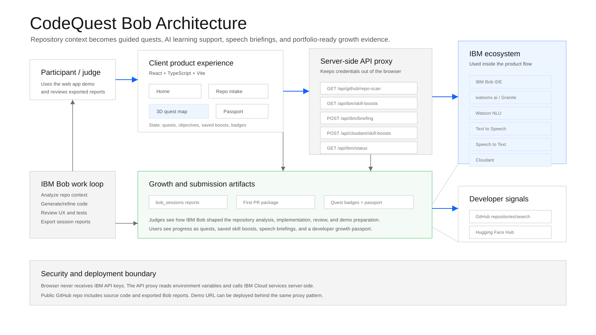

# CodeQuest Bob

> Others explain code. CodeQuest Bob grows developers.

CodeQuest Bob is a gamified developer onboarding platform built for the IBM Bob Hackathon. It turns an unfamiliar GitHub repository into a guided growth journey: scan the repo, understand the structure, complete contribution quests, collect service stamps, and prepare a first pull request package.

The project was built as a solo hackathon MVP with IBM Bob as the development partner and IBM Cloud services powering live repository learning experiences.


## Live Demo

- Demo app: [https://codequest-bob.vercel.app](https://codequest-bob.vercel.app)
- Public repository: [https://github.com/1wos/CodeQuestBob](https://github.com/1wos/CodeQuestBob)
- Pitch deck: [docs/submission-assets/rendered/codequest-bob-pitch-deck.pdf](docs/submission-assets/rendered/codequest-bob-pitch-deck.pdf)
- Demo video: [docs/submission-assets/demo-video/codequest-bob-demo-voiceover.mp4](docs/submission-assets/demo-video/codequest-bob-demo-voiceover.mp4)

## Problem

New contributors often lose momentum before their first meaningful pull request. Repository structure, setup steps, contribution norms, and missing documentation create a cognitive wall. Existing AI tools can explain code, but they rarely turn that understanding into a measurable growth path for the developer.

CodeQuest Bob reframes onboarding as a product experience:

- make repository context visible
- guide the contributor through concrete quests
- recommend just-in-time learning resources
- package the first PR workflow
- preserve progress as portfolio-ready growth evidence

## Solution

CodeQuest Bob converts repository context into a guided developer growth journey.

```text
Repository Intake
  -> Live GitHub Scan
  -> Growth Quest Map
  -> Quest Detail + Skill Boost Radar
  -> First PR Package
  -> Developer Growth Passport
```

The core product idea is simple: the developer should not only understand the repo. They should leave with confidence, evidence, and a next action.

## Key Features

### Live Repository Intake

Users can paste a public GitHub repository URL and refresh repository metadata through a server-side API route. The app surfaces repository name, description, default branch, language breakdown, root files, and contribution context.

### Growth Quest Map

The onboarding path is represented as a horizontal quest system:

1. Setup Quest
2. Explore Quest
3. Improve Quest
4. First PR Quest

Each quest has level, difficulty, estimated time, XP, objectives, and a completion path. The quest cards are designed to feel like professional developer achievements rather than decorative game UI.

### 3D Repository Orbit Map

The quest map includes a React Three Fiber / Three.js orbit visualization that represents the repository as an interactive spatial system. It gives the demo a memorable 2.5D/3D layer while keeping the main workflow practical.

### Skill Boost Radar

Skill Boost Radar pulls live developer learning signals from GitHub Search and Hugging Face, then uses IBM Natural Language Understanding and watsonx.ai / IBM Granite to translate those signals into quest-specific learning recommendations.

Saved recommendations appear in the Developer Growth Passport.

### IBM Speech Briefing Loop

Quest objectives can be converted into an audio onboarding briefing through IBM Text to Speech and verified through IBM Speech to Text. This demonstrates speech UX inside the product flow, not only as a standalone API check.

### First PR Package

The final quest prepares a contribution-ready package:

- starter task
- target files
- commands to run
- PR title draft
- PR description draft
- reviewer notes
- completion checklist

### Developer Growth Passport

The passport tracks XP, completed quests, saved learning resources, activity timeline, AI analysis activity, and service stamps. It is designed as a lightweight portfolio artifact for developer growth.

## IBM Bob Usage

IBM Bob was used as the primary AI development partner throughout the project. Bob helped with:

- repository analysis and MVP planning
- React + TypeScript architecture decisions
- quest system and growth passport design
- IBM ecosystem integration planning
- UI/UX review and copy refinement
- implementation review and submission readiness
- final polish tasks for the hackathon demo

Exported IBM Bob task history is included for judging and portfolio transparency:

```text
bob_sessions/
  README.md
  session-01-bob-task-history.md
```

## IBM Ecosystem Integration

| IBM technology | How it is used |
| --- | --- |
| IBM Bob IDE | Repository-aware planning, implementation support, review, exported task history |
| watsonx.ai / IBM Granite | Skill Boost reasoning and AI-generated recommendation explanations |
| Watson Natural Language Understanding | Keyword extraction from learning resources and repository-related text |
| Watson Text to Speech | Audio quest briefing generation |
| Watson Speech to Text | Transcript verification for the generated briefing |
| IBM Cloudant | Server-side save path for Skill Boost records when configured |

API keys are never exposed to the browser. IBM service calls go through server-side routes in `api/`.

## Architecture



```text
React + TypeScript client
  -> Vercel serverless API proxy
  -> IBM Cloud services
  -> GitHub Search / Hugging Face signals
  -> Developer Growth Passport
```

More architecture notes are available in [docs/architecture/README.md](docs/architecture/README.md).

## Tech Stack

- React
- TypeScript
- Vite
- Three.js
- React Three Fiber
- Drei
- Lucide React
- Vercel
- IBM watsonx.ai / IBM Granite
- IBM Watson Natural Language Understanding
- IBM Watson Text to Speech
- IBM Watson Speech to Text
- IBM Cloudant-ready API route

## Repository Structure

```text
src/
  app/                  App shell and state context
  components/
    ibm/                Bob briefing UI
    passport/           Service stamps
    skill-boosts/       Skill Boost Radar
    three/              3D repository orbit map
    ui/                 Shared UI components
  data/                 Demo data and IBM service metadata
  domain/               TypeScript domain models
  screens/              Product screens

api/                    Vercel serverless API routes
bob_sessions/           Exported IBM Bob task history
docs/                   Product brief, architecture, cloud setup, submission assets
```

## Local Development

```bash
npm install
npm run dev
```

## Build

```bash
npm run build
```

## Environment Variables

Copy `.env.example` to `.env.local` for local API testing.

```bash
cp .env.example .env.local
```

Do not commit `.env.local`, IBM Cloud API keys, IAM tokens, downloaded service credentials, or secrets copied from exported task sessions.

## Security Notes

- Secrets are server-side only.
- Browser-exposed variables should not contain IBM credentials.
- Exported Bob reports are checked for sensitive tokens before committing.
- `.env.local` and Vercel project metadata are ignored.

## Submission Assets

Final hackathon assets live in [docs/submission-assets](docs/submission-assets):

- cover image
- pitch deck PDF
- editable pitch deck PPTX
- demo video
- demo script
- requirements checklist

## Portfolio Note

This project is a compact example of AI-assisted product engineering: turning a vague hackathon prompt into a deployed developer tool with a clear user journey, live service integrations, 3D interaction, generated presentation assets, and traceable AI development history.

